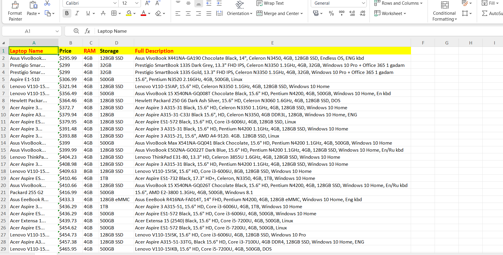

# E-Commerce Laptops Web Scraper

A Python-based web scraper that extracts e-commerce laptop listings, cleans unstructured data using Regex, and exports formatted structured data into Microsoft Excel (.xlsx).

## Features
- **Automated Web Scraping:** Uses `requests` and `BeautifulSoup` to scrape product listings.
- **Regex Spec Extraction:** Automatically parses RAM and Storage specifications into clean columns.
- **Excel Export:** Exports cleaned data directly into structured Excel (`.xlsx`) using `pandas` and `openpyxl`.

## Scraped Data Preview

